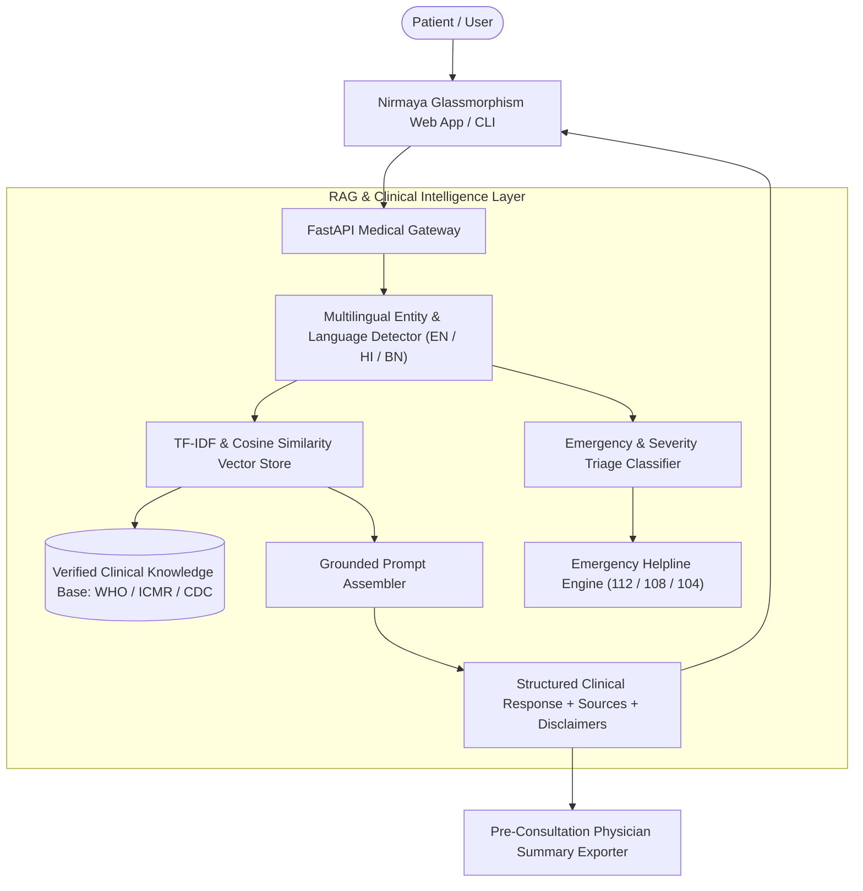

# 🌿 Nirmaya — Grounded AI Health Chatbot (RAG Medical Assistant)
### *Smart India Hackathon (SIH) Project • Multilingual Clinical Guidance & Triage*


-teal)


---

## 🌟 Overview
**Nirmaya** is a Retrieval-Augmented Generation (RAG) AI Healthcare Chatbot built for the **Smart India Hackathon**. Unlike generic generative chatbots that hallucinate medical facts, Nirmaya strictly retrieves verified clinical protocols (WHO, ICMR, CDC, MoHFW India) to provide preliminary symptom analysis, home care recommendations, red-flag emergency detection, and clinical triage guidance across multiple languages (**English**, **Hindi - हिंदी**, **Bengali - বাংলা**).

---

## 🏛️ System Architecture



---

## ✨ Key Features

1. **📚 Zero-Hallucination RAG Grounding:**
   - Vector retrieval over verified clinical datasets covering fever, infectious diseases (Dengue, Malaria), gastrointestinal issues (GERD, Dysentery), chronic conditions (Diabetes, Hypertension), and cardiovascular warnings.
   - Every answer transparently cites official sources (WHO, ICMR, CDC, AHA).

2. **🚦 3-Tier Clinical Triage Engine:**
   - **🟢 Green (Mild / Home Care):** Supportive lifestyle & home remedy measures.
   - **🟡 Yellow (Moderate / Consult Doctor):** Clinical consultation recommended within 24-48h.
   - **🔴 Red (Critical Emergency):** Immediate alert with 112/108 ambulance dispatch advisory.

3. **🇮🇳 Multilingual Indian Language Support:**
   - Native comprehension for English, Hindi (*"2 din se tez bukhar hai"*), and Bengali (*"জ্বর এবং সর্দি"*).

4. **🛡️ Strict Medical Ethics & Guardrails:**
   - Mandatory statutory medical disclaimer on every interaction.
   - Automatic emergency hotline banner with click-to-call integration.

5. **📄 Pre-Consultation Summary Exporter:**
   - One-click generation of printable/PDF doctor consultation notes summarizing reported symptoms and triage timestamps.

---

## 🚀 Quick Start

### 1. Installation
```bash
# Clone the repository
git clone https://github.com/Kanishka22222/nirmaya-health-chatbot.git
cd nirmaya-health-chatbot

# Install dependencies
pip install -r requirements.txt
```

### 2. Launch Web Interface
```bash
python server.py
```
Open **`http://localhost:8002`** in your browser.

### 3. Run in Terminal CLI Mode
```bash
python cli.py
```

---

## 🧪 Running Automated Unit Tests
```bash
python -m unittest discover tests
```

---

## 📄 License & Attribution
Developed by **Kanishka Gaurav** for the **Smart India Hackathon (SIH)**.
